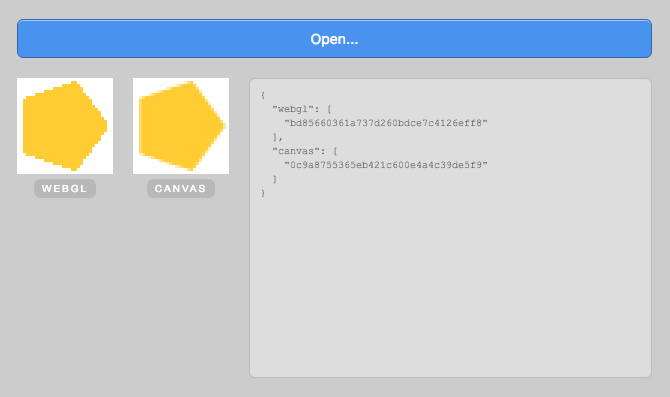

# PixiAnimate Tests Tool

Generate unit-test solutions for rendering with PixiAnimate.

## Usage

Launch the application by navigating to the application in Terminal or on a commandline. Then run:

```bash
npx electron .
```


